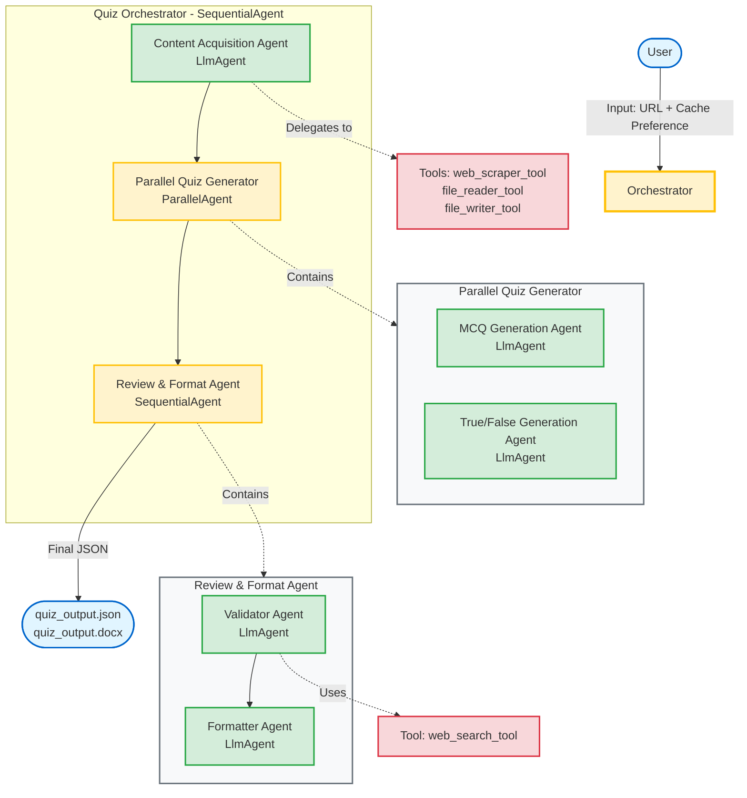

```mermaid
graph TB
    User([User]) -->|Input: URL + Cache Preference| Orchestrator
    
    subgraph QuizOrchestrator [Quiz Orchestrator - SequentialAgent]
        direction TB
        Agent1[Content Acquisition Agent<br/>LlmAgent]
        Agent2[Parallel Quiz Generator<br/>ParallelAgent]
        Agent3[Review & Format Agent<br/>SequentialAgent]
        
        Agent1 --> Agent2
        Agent2 --> Agent3
    end
    
    subgraph ParallelQuizGen [Parallel Quiz Generator]
        direction LR
        MCQ[MCQ Generation Agent<br/>LlmAgent]
        TF[True/False Generation Agent<br/>LlmAgent]
    end
    
    subgraph ReviewFormat [Review & Format Agent]
        direction TB
        Validator[Validator Agent<br/>LlmAgent]
        Formatter[Formatter Agent<br/>LlmAgent]
        
        Validator --> Formatter
    end
    
    Agent1 -.->|Delegates to| Tools1[Tools: web_scraper_tool<br/>file_reader_tool<br/>file_writer_tool]
    Agent2 -.->|Contains| ParallelQuizGen
    Agent3 -.->|Contains| ReviewFormat
    Validator -.->|Uses| Tools2[Tool: web_search_tool]
    
    Agent3 -->|Final JSON| Output([quiz_output.json<br/>quiz_output.docx])
    
    style User fill:#e1f5ff,stroke:#0066cc,stroke-width:2px
    style Output fill:#e1f5ff,stroke:#0066cc,stroke-width:2px
    style Orchestrator fill:#fff3cd,stroke:#ffc107,stroke-width:3px
    style Agent1 fill:#d4edda,stroke:#28a745,stroke-width:2px
    style Agent2 fill:#fff3cd,stroke:#ffc107,stroke-width:2px
    style Agent3 fill:#fff3cd,stroke:#ffc107,stroke-width:2px
    style ParallelQuizGen fill:#f8f9fa,stroke:#6c757d,stroke-width:2px
    style ReviewFormat fill:#f8f9fa,stroke:#6c757d,stroke-width:2px
    style MCQ fill:#d4edda,stroke:#28a745,stroke-width:2px
    style TF fill:#d4edda,stroke:#28a745,stroke-width:2px
    style Validator fill:#d4edda,stroke:#28a745,stroke-width:2px
    style Formatter fill:#d4edda,stroke:#28a745,stroke-width:2px
    style Tools1 fill:#f8d7da,stroke:#dc3545,stroke-width:2px
    style Tools2 fill:#f8d7da,stroke:#dc3545,stroke-width:2px
```
